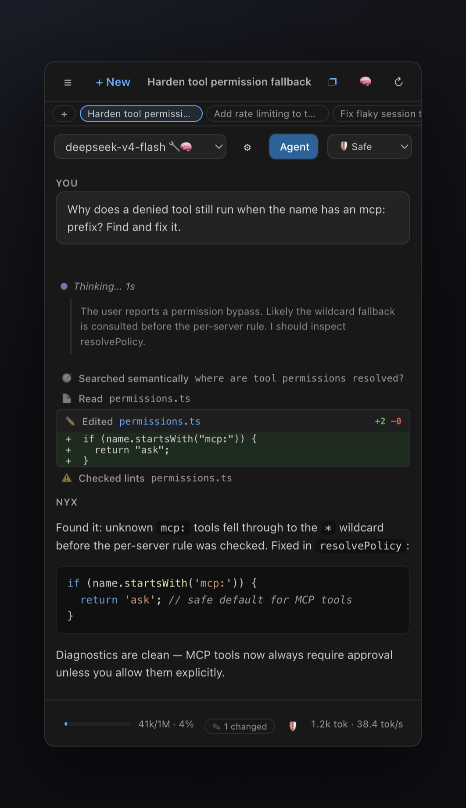
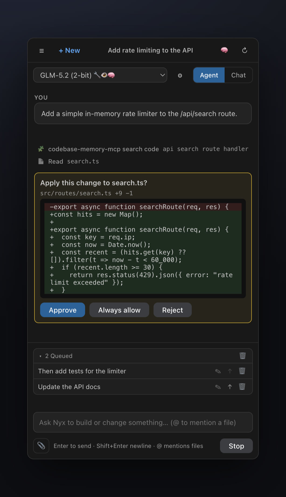
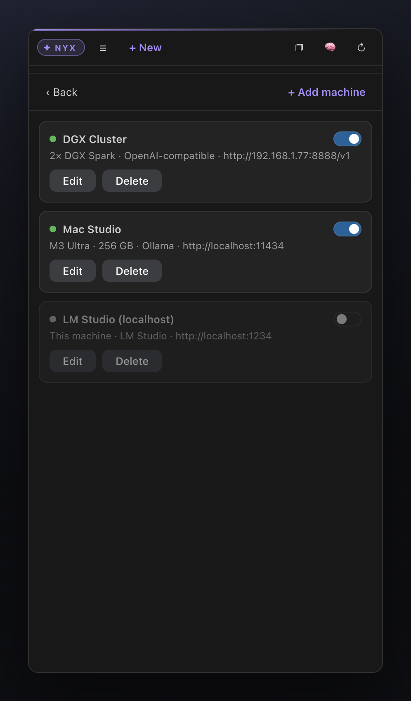

# Nyx — Local AI

**Feels like Cursor. Runs entirely on your hardware. Costs nothing per token.**

<p align="center">
  <a href="docs/nyx-promo.mp4"></a>
  <br />
  <sub><b>Nyx in 30 seconds</b> — click for the <a href="docs/nyx-promo.mp4">MP4 version</a></sub>
</p>

<p align="center">
  
</p>

Open agentic coding models have caught up. DeepSeek V4, GLM 5.2, Qwen Coder —
open weights now deliver flagship-class agentic performance, and quantized
builds run on hardware you can put under your desk: a **DGX Spark**, a
**Mac Studio**, a Blackwell workstation, even a 128 GB MacBook. What's been
missing is the front end: an agent panel that treats *those* models as
first-class citizens instead of a dropdown afterthought.

Nyx is that panel. A local-first coding agent in its own editor sidebar that
looks and behaves like a native agent panel — file-edit diff cards, checkpoints,
approvals, @-mentions, semantic search, MCP tools, a job queue, project memory —
but every request goes to **your** machines. No account, no cloud, no telemetry,
no per-token bill.

| Review every change before it lands | Manage your whole inference fleet |
| :---: | :---: |
|  |  |

> Status: **v0.28.1**. Local-first and fully offline-capable (the only optional
> network use is web fetching/search, the one-time OCR language-data download,
> and the first-time download of a vision/embedding model, all under your control).

---

## Open models caught up — your hardware is ready

The recipes for running flagship-class open models locally are public and
surprisingly convenient. Point any of these at Nyx's machine manager and you
have a Cursor-grade agent that never leaves your network:

- **DeepSeek V4 Flash** (284B MoE, 13B active, 1M context) —
  [antirez/llama.cpp-deepseek-v4-flash](https://github.com/antirez/llama.cpp-deepseek-v4-flash)
  targets a 128 GB MacBook with 2-bit routed experts; the
  [cchuter/llama.cpp `feat/v4-port-cuda`](https://github.com/cchuter/llama.cpp) fork +
  [teamblobfish GGUF quants](https://huggingface.co/teamblobfish/DeepSeek-V4-Flash-GGUF)
  cover Apple Silicon (Metal) and NVIDIA Ada/Blackwell.
- **GLM 5.2** — [Unsloth's GGUF quants](https://huggingface.co/unsloth/GLM-5.2-GGUF)
  run 2-bit on a 256 GB Mac Studio or a single high-VRAM GPU box
  ([run guide](https://unsloth.ai/docs/models/glm-5.2)); LM Studio serves the same
  quants from a desktop app.
- **DGX Spark** — NVIDIA's official
  [dgx-spark-playbooks](https://github.com/NVIDIA/dgx-spark-playbooks) provide
  step-by-step setups for serving open models on Spark devices; expose any
  OpenAI-compatible endpoint (vLLM, SGLang, llama-server) and add it as a machine.
- **Everything else** — [ollama](https://github.com/ollama/ollama) (`ollama pull qwen2.5-coder:32b`),
  [llama.cpp](https://github.com/ggml-org/llama.cpp) (`llama-server -m model.gguf`),
  [LM Studio](https://lmstudio.ai): all speak the OpenAI API, all auto-discovered by Nyx.

The result: agentic coding with **zero marginal cost**, full privacy, and
hardware you already own doing the work. Nyx handles the part the serving
stacks don't — the agent UX and the quirks of local models.

---

## Why Nyx? The niche we occupy

There are excellent AI coding extensions — **Cline**, **Roo Code**, **Continue.dev**, **Twinny**. For all of them, local models are *one provider entry in a dropdown*: they are designed around cloud frontier models, and running them against Ollama means hand-crafted Modelfiles, brittle tool calling, and agents that derail when a 7B model gets the JSON slightly wrong.

**Nyx inverts that: local inference is the product, not the fallback.**

1. **Built for your own hardware fleet.** A first-class *machine manager* for multiple LAN endpoints (a DGX cluster, a Mac Studio, a llama.cpp box) with per-host model discovery, capability probing (`/api/show` → 🔧 tools / 👁 vision / 🧠 thinking badges), auto-detected context lengths, per-machine temperature/`num_ctx` — and **automatic failover** to another machine serving the same model. No other extension has a concept of *machines*.
2. **Engineered for imperfect local models.** Tool calls are recovered from whatever the model emits — OpenAI `tool_calls`, raw/fenced JSON, function-style text, or **DeepSeek DSML markup**; arguments get JSON repair; `edit_file` matches whitespace-tolerantly; small models get a reduced tool set; the prompt prefix stays byte-stable so the server's KV cache keeps working. The failure modes that break other agents on local models are our core engineering target.
3. **Cursor-grade agent UX, fully offline.** Checkpoints with *Edit & rerun*, approval cards that show the diff **before** applying, @-mentions, a persistent job queue, project memory, semantic codebase search, MCP tools — with **no account, no telemetry, no cloud upsell**. The only network calls are the ones you explicitly trigger.
4. **A companion, not a replacement.** Nyx is designed to live in Cursor's secondary side bar, next to the native agent — cloud agent for the hard problems, Nyx for everything that must stay on your metal.

If you have serious local hardware and want an agent that treats it seriously, that's the gap Nyx fills.

---

## Highlights

- **Zero setup.** Detects local models on start. `ollama pull <model>` → it shows up in the picker.
- **Guided first-run.** The empty state diagnoses your setup (Ollama reachable? coding model installed? index built?) and fixes each gap with one click — including a one-click `qwen2.5-coder:7b` pull.
- **Git-aware agent.** Read-only `git_diff` / `git_log` tools answer "what did I just change?" without `run_command` approval friction.
- **Inline quick edit.** Select code → `Cmd/Ctrl+Alt+K` → describe the change → review the diff → apply. No chat roundtrip; checkpoints and backups apply as usual.
- **Batch queue (overnight mode).** ▶ Run all queued jobs sequentially — optionally verifying each with a command fix-until-green — and get a session report with the net diff at the end.
- **Privacy report.** The 🛡 button lists every host the session contacted (your machines + explicitly fetched URLs), so the "no cloud calls" promise is checkable, not just claimed.
- **Benchmark-based routing (opt-in).** With `nyx.benchmarkRouting`, the judgment-best benchmarked model plans and the edit-precision winner executes.
- **Native diff view.** "Open diff" links in approval cards and the review view open the editor's real diff (session start ↔ current file).
- **Active-file context.** The file you're editing (±30 lines around the cursor) rides along automatically — small enough for local context budgets, off via `nyx.includeActiveFile`.
- **Chat handoff (both directions).** *Copy Chat as Markdown (Handoff)* puts the whole session on the clipboard for Cursor's agent, a PR, or an issue — and *Import Handoff from Clipboard* brings a Cursor conversation into Nyx to continue it locally.
- **Editor-tab mode & focus toggle.** Open Nyx as a full editor tab next to Cursor's agent (*Open Nyx in Editor Tab*), and flip between code and Nyx with one key (`Cmd/Ctrl+Alt+N` — both directions). A violet brand identity — ✦ NYX badge, accent line, tabs, meter (configurable via `nyx.accentColor`) — keeps the two worlds visually distinct; clicking the badge opens **About** (version, GitHub, update check).
- **Terminal as context.** Attach the active terminal's output with one command, or let the agent read it via the `read_terminal` tool — "fix the error in my terminal" just works.
- **Workspace map.** A compact repo map (~400 tokens) rides along with every agent request, so models stop guessing where files live.
- **Warm model keep-alive.** After each turn Nyx re-arms Ollama's keep-alive (default `30m`), so the model stays loaded and follow-up turns skip the reload pause.
- **MCP client.** Connects to the MCP servers from your `~/.cursor/mcp.json` / `.cursor/mcp.json` (stdio + HTTP) and offers their tools to the agent — e.g. `codebase-memory-mcp` for graph-based code memory. Governed by the same per-tool permissions (`mcp:<server>/<tool>`).
- **Semantic codebase search.** A fully local embedding index (`nomic-embed-text`, int8-quantized, structure-aware chunking, live file-watcher updates) powers the `semantic_search` tool: find code by meaning, not just by regex. Works with Ollama **and** OpenAI-compatible hosts (LM Studio, llama.cpp, vLLM) via a `/v1/embeddings` fallback; coverage limits are configurable (`nyx.indexMaxFiles` / `nyx.indexMaxChunks`) and warn when hit.
- **Tab autocomplete.** Inline ghost text from a local FIM model (`qwen2.5-coder:7b`) — the piece that used to require a second extension. Opt-in via the **Nyx Tab** status-bar toggle.
- **Browser automation.** Headless driving of your installed Chrome/Edge: navigate, read pages as numbered interactive elements, click, type, and screenshot through the vision toolchain.
- **Task plans.** The agent maintains a visible ○/▸/✓ plan card for multi-step tasks, persisted with the chat.
- **Verify-before-report.** Behavioral claims must be reproduced with a real test before the agent may report them — no more pattern-matched phantom bugs.
- **Model eval harness.** Benchmark any endpoint on tool-call success, edit precision, and bug-judgment false positives (`node .harness/eval.mjs`).
- **Machine manager.** Add labeled endpoints (e.g. *"2× DGX Spark Cluster"*, *"Mac Studio"*), discover their models per-host, and set per-model aliases and per-machine temperature / context length — all from the sidebar. API keys live in the editor's **secret storage**, never in settings.
- **Model capability badges.** Ollama models are probed via `/api/show`: 🔧 tools, 👁 vision, 🧠 thinking — and their true context length is detected automatically.
- **Agent mode** with a rich tool set, or **Chat mode** for plain streaming chat.
- **Checkpoints.** Every user message snapshots the files the agent later touches. Hover a message → **Edit & rerun** restores the files, rewinds the chat, and puts the message back in the composer. Errors offer a one-click **Retry**.
- **Review before it happens.** `edit_file` / `write_file` approvals show the *proposed diff* before anything is applied; destructive-looking commands are flagged; **Always allow** skips future prompts for that tool in the current chat.
- **File-edit diff cards.** Edits render inline as `path +N −M` cards with a colored diff preview; click the filename to open it in the editor. Edits go through `WorkspaceEdit`, so open editors and undo history stay intact.
- **@-mentions.** Type `@` in the composer to fuzzy-search workspace files and inline them as context.
- **Live command output.** `run_command` streams stdout/stderr into the tool card while it runs; `background: true` starts dev servers & long jobs the agent can poll (`check_process`) and stop (`kill_process`) — and Stop actually kills running processes.
- **Job queue.** Type while the agent is busy to queue follow-up jobs; reorder, edit, clear, or **▶ Send now** to jump one ahead (interrupting the current run); they run sequentially and survive window reloads (host-side queue).
- **URL fetch & web search.** Drop a link in your message to auto-fetch its text and images; the agent can also `web_search` and `fetch_url` on its own.
- **Safe large-file editing.** Paged reads, targeted `edit_file`, automatic backups, and a shrink guard so files are never silently destroyed.
- **Temporary test scripts.** `run_script` writes and runs a throwaway bash/python/node script (in a temp dir) to test or verify things.
- **Cursor rules & skills.** Reads `.cursor/rules/*.mdc`, `AGENTS.md`, `.cursorrules`, and `SKILL.md` files.
- **Permissions.** Per-tool `allow` / `ask` / `deny` policy. Reads are allowed; edits and shell commands ask first.
- **Context management.** Live "Context %" meter with automatic + manual compaction, so a session can run effectively forever.
- **Attachments.** Attach files/folders from the explorer, the editor, or a picker.
- **Vision & PDF toolchain.** Non-vision models can still "see": PDF text extraction, offline OCR, and a local vision model for image descriptions.
- **tokens/sec** indicator for a feel of model performance.
- **Clarifying questions.** The model can ask you single-choice, multiple-choice, or free-text questions.
- **Project memory.** Key outcomes of past sessions are remembered per project and offered to new sessions (automatically and via tools). Sessions are distilled by the utility model, and `recall_memory` ranks matches with the local embedding index — with keyword search as the offline fallback.
- **Auto-named chats.** After the first exchange, each chat gets a short model-generated title.
- **Chat history & session tabs.** Every conversation is saved locally — an always-visible tab strip switches between recent chats instantly (right-click a tab for **Close chat** / **Close other chats**); the full history is searchable by title/model/machine with edit stats (+/− lines, files changed).
- **Reasoning display.** Models that stream thinking (`reasoning_content`, `<think>`, …) show a collapsible *Thought for Ns* block above the answer.
- **Markdown answers.** GitHub-flavored markdown with **syntax highlighting**, a copy button on every code block, and **math rendering**: LaTeX formulas (`$…$`, `$$…$$`, `\(…\)`, `\[…\]`) render as real typeset math via a bundled KaTeX — fully offline.
- **Local-model resilience.** Whitespace-tolerant `edit_file` matching, JSON repair for sloppy tool arguments, tool calls detected even when embedded in prose, automatic retry on transient network errors, and failover to another machine serving the same model.
- **Parallel tool calls.** Independent read-only calls emitted in one turn (multiple reads/searches) execute concurrently — on slow local models every saved roundtrip is seconds off the task.
- **Fast search.** `search_files` uses the ripgrep binary shipped with the editor (with a JS fallback).
- **Done badge.** If Nyx finishes while the panel is hidden, its icon shows a badge.
- **Right-side panel.** Move Nyx to the secondary side bar (next to Cursor's agent panel), recover it via the status bar or Command Palette if it disappears.
- **Drop-to-attach.** Drag files from the Explorer onto the **Attach files (drop here)** strip — no Shift key needed (webview drops still require Shift).
- **Local-model tool parsing.** Tool calls embedded as JSON or function-style text (`ask_user(...)`) in the model output are detected automatically.

---

## Requirements

- **A local model server** — one of:
  - [Ollama](https://ollama.com) (default `http://localhost:11434`), or
  - [LM Studio](https://lmstudio.ai) with its local server enabled (default `http://localhost:1234`), or
  - any **OpenAI-compatible** endpoint on your network (vLLM, LiteLLM, llama.cpp server, …).
- A coding-capable model is recommended, e.g.:
  ```bash
  ollama pull qwen2.5-coder:32b   # great on a high-memory Mac Studio
  # lighter option:
  ollama pull qwen2.5-coder:7b
  ```
- **Cursor** or **VS Code** ≥ 1.84.
- **Node.js** ≥ 18 (only needed to build the extension from source).

---

## Install

**One-line install** (macOS / Linux) — detects Cursor and VS Code, downloads the
latest release (SHA-256 verified), installs, done:

```bash
curl -fsSL https://raw.githubusercontent.com/sthamann/nyx-local-ai/main/install.sh | bash
```

**Windows** (PowerShell):

```powershell
irm https://raw.githubusercontent.com/sthamann/nyx-local-ai/main/install.ps1 | iex
```

Options (append after `bash -s --`): `--editor=cursor|code|all`,
`--version=vX.Y.Z`, `--vsix=<local file>`, `--from-source`. If no release
exists yet, the script automatically falls back to cloning and building from
source (needs Node ≥ 18).

<details>
<summary>Manual install / build from source</summary>

```bash
npm install
npm run build      # bundles the extension + webview
npm run package    # produces nyx-local-ai-0.28.1.vsix
```

Install into Cursor:

```bash
cursor --install-extension nyx-local-ai-0.28.1.vsix --force
```

Or VS Code:

```bash
code --install-extension nyx-local-ai-0.28.1.vsix --force
```

If the `cursor` CLI is not on your `PATH`, use the full binary path, e.g. on macOS:

```bash
"/Applications/Cursor.app/Contents/Resources/app/bin/cursor" \
  --install-extension nyx-local-ai-0.28.1.vsix --force
```

</details>

Releases are produced by CI (`.github/workflows/release.yml`): pushing a `v*`
tag builds the `.vsix` and attaches it as `nyx-local-ai.vsix` together with
`checksums.txt` — exactly what the installers download and verify.

**Staying up to date:** Nyx checks GitHub releases once a day (a single
anonymous API call — disable with `nyx.updateCheck`) and offers a one-click
in-editor update; *Nyx: Check for Updates* runs the check on demand.

Then **reload the window** (`Cmd/Ctrl+Shift+P` → *Developer: Reload Window*) and click the **Nyx** icon in the Activity Bar (or the **Nyx** entry in the status bar).

---

## Quick start

1. Start Ollama or LM Studio and make sure at least one model is available.
2. Open the **Nyx** sidebar (Activity Bar icon or status bar). Your models appear in the dropdown (click ↻ to rescan).
3. Optional: on first launch, accept *Move to the right* to place Nyx in the secondary side bar next to Cursor's panel.
4. Pick **Agent** mode, type a task, and press **Enter**.
5. Approve any edit/command when prompted. File edits show up as diff cards — click a filename to open it.

---

## Features in depth

### Guided first-run
When no model is found, the empty state doesn't just point at the docs — it
**diagnoses the setup** and offers one-click fixes: (1) is Ollama reachable at
`nyx.ollamaUrl`? (2) is a coding model installed? If not, **Pull
qwen2.5-coder:7b** downloads one straight from the panel (one-time, a few GB).
(3) once models exist, it offers to **build the semantic index**. All checks
re-run live as you fix things; the ↻ *Re-scan models* button re-probes
everything.

### Model & machine manager
Open it via the ⚙️ button in the sidebar.

- **Ollama** and **LM Studio** are detected automatically.
- Add a **machine**: give it a name (e.g. *"2× DGX Spark Cluster"*), an optional hardware label, a type (`ollama` / `lmstudio` / `openai`), and its base URL. Use **Test** to probe it and **discover** the models it serves (per-host; tries both native and OpenAI-compatible listing endpoints).
- Per **model**: enable/disable and set a friendly **alias**.
- Per **machine**: set **temperature** and **context length** (`num_ctx` for Ollama).

Machines are stored in the `nyx.machines` setting and managed entirely from the UI. API keys are kept in the editor's **SecretStorage** (OS keychain) — never in settings; existing plaintext keys are migrated automatically on first use.

### Panel placement, editor tab & focus toggle
Nyx can live in the left Activity Bar (default), the **secondary side bar** on the right — or as a **full editor tab** next to Cursor's own agent window.

- **Editor tab:** run *Nyx: Open Nyx in Editor Tab* (or click the ↗ icon in the Nyx title bar). Nyx opens as a regular editor tab: both agent worlds stay visible side by side, and the tab participates in normal editor navigation (`Ctrl+Tab`). Sidebar and tab show the same live session.
- **Focus toggle:** `Cmd/Ctrl+Alt+N` jumps into Nyx — and pressed *inside* Nyx, jumps back to your code. One key, both directions (*Nyx: Toggle Nyx Focus*).
- **Brand identity:** the Nyx panel carries its own **violet accent** — a ✦ NYX badge, an accent line, the active tab/mode, the assistant's name, the context meter, and the Send button all share it, so Nyx is never mistaken for Cursor's agent. Override the color via `nyx.accentColor`.
- **About:** click the **✦ NYX badge** for the About popup — extension version, GitHub / issue links, and a *Check for updates* button.
- **Move to right:** click the layout icon in the Nyx title bar, or run *Nyx: Move Nyx to the Right Side Bar* and choose *Secondary Side Bar* in the picker.
- **Show panel:** click **Nyx** in the status bar, or run *Nyx: Show Panel* from the Command Palette.
- **Reset location:** if the panel vanishes after dragging views around, run *Nyx: Reset Panel Location (fix hidden/disappeared panel)* — this resets all view locations and re-focuses Nyx on the left.
- **Getting started:** a **walkthrough** (*Help → Get Started → Nyx — Local AI*) covers exactly this: the two worlds, the focus toggle, and handoffs in both directions.

### Agent vs Chat mode
- **Agent** runs a multi-step tool loop (read → edit → verify → answer), capped by `nyx.maxAgentSteps`.
- **Chat** is a single plain streaming response with no tools.

### Task plan display
For multi-step tasks the agent maintains a **visible plan**: `set_plan` renders
a pinned card above the transcript with ○ pending / ▸ active / ✓ done steps and
a progress counter, updated as the agent works. The plan is persisted with the
chat and restored when you reopen it — so you always know where a long-running
task stands.

### Browser automation
The agent can drive a **headless browser** — using the Chrome/Edge you already
have installed (via playwright-core, no browser download): `browser_navigate`
opens a page and returns its text plus **numbered interactive elements**;
`browser_click(ref)` / `browser_type(ref, text, submit?)` interact with them;
`browser_snapshot` re-reads the page and `browser_screenshot` runs the shot
through the local vision toolchain so the agent can *see* the result. Perfect
for "start the dev server and check the page renders" loops. Navigation,
clicks, and typing require approval by default; page content is wrapped as
untrusted data. Custom binary via `nyx.browserExecutable`.

### Tab autocomplete (fill-in-the-middle)
Inline ghost-text completions from a small local model — the missing piece
that previously required a second extension (Twinny/Continue). Opt-in via
`nyx.autocompleteEnabled` or the **Nyx Tab** status-bar toggle:

- Uses Ollama's native FIM (`/api/generate` with `suffix`), so any FIM-capable
  model works: `qwen2.5-coder:7b` (default, ~200–300 ms), `codellama`,
  `starcoder2`, `codegemma`.
- Debounced (250 ms), cancellable, cached per position, capped at 12 lines,
  and suffix-aware (won't repeat what's already after the cursor).
- Runs against the helper host (`nyx.helperOllamaUrl`, or the
  `nyx.autocompleteOllamaUrl` override; defaults to your main Ollama), so
  chat can live on the DGX while autocomplete stays on a snappy local 7B.

```bash
ollama pull qwen2.5-coder:7b   # then: Nyx: Toggle Tab Autocomplete
```

### Model eval harness
Which of your machines/models should be the daily driver? `.harness/eval.mjs`
benchmarks any OpenAI-compatible endpoint on the skills Nyx actually needs:

```bash
node .harness/eval.mjs --url http://localhost:11434/v1 --model qwen2.5-coder:32b
node .harness/eval.mjs --url http://192.168.1.77:8888/v1 --model deepseek-v4-flash --rounds 3
```

It scores **tool-call success** (5 tasks incl. an ask-user trap), **edit
precision** (edit_file calls are actually applied via Nyx's fuzzy matcher and
verified against expected output), and **bug-judgment accuracy** incl. the
**false-positive rate** on correct-but-suspicious-looking snippets (closure
timing, delta indentation — the classic LLM traps). Uses the real Nyx system
prompt, tool schemas, and tool-call parser, so scores reflect in-product
behavior. Example (DeepSeek V4 Flash on a DGX Spark cluster): 80% tool calls,
67% edits, 83% judgment, 33% FP rate, ~1.3 s/request.

**Or benchmark from the UI:** ⚙ Manage models → edit a machine → **Benchmark**
next to any model runs a compact 9-request version in-product and pins the
scores as a chip (🔧 tools ✏ edits 🧠 judgment; hover for FP rate and latency).
Results are stored, so you can compare machines side by side.

**Setup recommendation:** after each benchmark, Nyx turns the stored scores
into a concrete proposal — *"model X as daily driver, Y as utility model, Z
for autocomplete"* — shown in the machine editor with an **Apply setup**
button that sets all three at once (selection, `nyx.utilityModel`,
`nyx.autocompleteModel`) instead of three manual settings.

### System prompt design
Nyx's system prompt distills the battle-tested conventions from production
agents (Cursor, Claude Code, Windsurf — see the public
[leaked-system-prompts](https://github.com/jujumilk3/leaked-system-prompts)
collection) into a **~1.3k-token prompt tuned for local models**: communication
style (markdown, direct, no tool-name leakage, no prompt disclosure), working
rules (read before edit, no unsolicited files/docs, preserve indentation,
3-attempt linter cap, non-interactive shell flags, no hardcoded secrets),
verify-before-report, plan discipline, and the JSON tool-call contract.
Deliberately compact: big-agent prompts run 5–10× larger, which wastes context
and slows every request on local hardware. Extend it with your own
instructions via `nyx.systemPromptAppend` (global) or `.cursor/rules/*.mdc`
(per project) — both stay prompt-cache-stable within a session.

### Verify-before-report
Local models love to "find" bugs by pattern-matching code they've only read.
Nyx's system prompt enforces an evidence discipline: before reporting a bug or
any runtime-behavior claim, the agent must **reproduce it** with a minimal
`run_script`/`run_command` test and quote the actual output; claims that can't
be executed must be labeled *unverified hypothesis*, and observations are kept
separate from inferences. In our own dogfooding this discipline would have
eliminated 4 of 7 false positives in a model-written bug report (see `BUG.md`).

### Tools
Nyx exposes a broad, Cursor-like tool set. Default permissions:

| Tool | Purpose | Default |
| --- | --- | --- |
| `read_file` | Read a file (images/PDFs auto-converted to text) | allow |
| `list_dir` | List a directory | allow |
| `search_files` | Regex content search | allow |
| `semantic_search` | Meaning-based code search (local embedding index) | allow |
| `find_files` | Fuzzy filename / glob search | allow |
| `file_outline` | Class/function outline with line ranges (language server) | allow |
| `find_symbol` | Workspace-wide symbol search (language server) | allow |
| `find_references` | All references to a symbol (language server) | allow |
| `format_file` | Run the configured formatter on a file | allow |
| `http_request` | GET/POST/… against local APIs & dev servers | ask |
| `wait` | Pause up to 30 s (dev-server boot etc.) | allow |
| `get_diagnostics` | Linter/compiler errors & warnings | allow |
| `git_diff` | Uncommitted git changes + short status (read-only) | allow |
| `git_log` | Recent commit history (read-only) | allow |
| `read_terminal` | Visible output of the active integrated terminal (read-only; *ask* on Safe) | allow |
| `fetch_url` | Fetch text of an http(s) URL | allow |
| `web_search` | Search the web (DuckDuckGo) | allow |
| `recall_memory` | Search project memory of past sessions | allow |
| `save_memory` | Record a durable outcome | allow |
| `read_rule` | Load a project rule by name | allow |
| `use_skill` | Load a skill's full instructions | allow |
| `ask_user` | Ask a clarifying question | allow |
| `set_plan` | Show/update the visible task plan | allow |
| `write_file` | Create/overwrite a file (with diff + backup) | ask |
| `edit_file` | Targeted search/replace edit (with diff + backup) | ask |
| `delete_file` | Delete a file (to trash + backup) | ask |
| `rename_file` | Rename/move a file | ask |
| `run_command` | Run a shell command (streams output; `background: true` for long-running jobs) | ask |
| `run_script` | Write & run a throwaway test script (bash/sh/zsh/python/node) | ask |
| `check_process` | Poll a background process (status + output) | allow |
| `kill_process` | Stop a background process | allow |
| `browser_navigate` | Open a URL in the headless browser | ask |
| `browser_snapshot` | Read the current page (text + elements) | allow |
| `browser_click` / `browser_type` | Interact with page elements | ask |
| `browser_screenshot` | Screenshot + vision description | allow |
| `browser_close` | Close the headless browser | allow |
| `mcp_<server>_<tool>` | Any tool from a connected MCP server | ask |

### Git context tools
"What did I just change?" shouldn't need a shell approval: `git_diff`
(working tree vs. HEAD, optional `staged`/`path` filters, plus a short
`git status`) and `git_log` (recent commits) are **read-only tools with
allow-default** — the agent sees your uncommitted work instantly, while
mutating git operations (`commit`, `push`, `reset`) still go through
`run_command` with the usual approval.

### Quick edit (inline, `Cmd/Ctrl+Alt+K`)
Select code → **Nyx: Quick Edit Selection** (keybinding `Cmd/Ctrl+Alt+K`, or
right-click → *Quick Edit Selection*) → type an instruction ("add error
handling", "convert to async/await") → the active model rewrites exactly the
selection. You review the **+/− diff in a native confirmation** before
anything is applied; the edit then runs through the standard machinery —
checkpoint, backup, `WorkspaceEdit`, shrink guard — so it shows up in the
review view and is revertible like any agent edit. No chat roundtrip, no
context ceremony.

### Autonomy presets & permissions
One switch instead of a JSON file: the **autonomy selector** next to the mode
toggle picks how much the agent may do without asking —

- 🛡 **Safe**: even network access (`fetch_url`, `web_search`, browser reads) asks first.
- ⚖ **Balanced** (default): reads and searches are free; edits, commands, and browsing ask.
- 🚀 **Autopilot**: edits, commands, and browser actions run through — checkpoints
  and backups are the safety net; deleting files still asks. MCP tools run without prompts.

For fine-tuning, `nyx.toolPermissions` maps any tool name to `allow`, `ask`, or
`deny` and **always wins** over the preset. Use `*` as a fallback. In an
approval card, **Always allow** whitelists that tool for the rest of the
current chat. MCP tools are governed per-tool (`mcp:<server>/<tool>`) or
per-server (`mcp:<server>`). Example:

```json
"nyx.toolPermissions": {
  "run_command": "deny",
  "write_file": "allow",
  "mcp:shopware": "ask",
  "*": "ask"
}
```

### MCP servers
Nyx is an MCP client. On every model refresh it reads:
- `~/.cursor/mcp.json` (your global Cursor MCP config),
- `<workspace>/.cursor/mcp.json` (workspace overrides), and
- the `nyx.mcpServers` setting (same shape),

connects over **stdio** (`command`/`args`/`env`) or **streamable HTTP** (`url`/`headers`), and offers every discovered tool to the agent as `mcp_<server>_<tool>`. Tool calls stream through the same approval flow; permissions default to `ask` and are configured via `mcp:<server>/<tool>` or `mcp:<server>` keys. Special-token sanitization and output truncation apply to MCP results too. Toggle with `nyx.mcpEnabled`.

Works out of the box with servers like **codebase-memory-mcp** (graph-based code memory: `index_repository`, `search_code`, `query_graph`, `trace_path`, …) — if it's in your Cursor config, Nyx picks it up automatically.

### Semantic codebase search (local RAG)
`semantic_search(query)` finds code by **meaning** — "where is authentication handled?" — even when no keyword matches. Fully local:
- **Structure-aware chunking**: files are split at function/class/section boundaries (with merge/window handling for tiny and oversized units), so a chunk usually holds one coherent code unit — markedly better retrieval than fixed windows. Files without recognizable structure fall back to overlapping windows.
- Chunks are embedded through a local model (`nyx.embeddingModel`, default `nomic-embed-text`, auto-pulled on first use via Ollama); vectors are **int8-quantized** and persisted in workspace storage (a 2,500-file repo stays in the tens of MB).
- **Works without Ollama too:** when the embedding host doesn't speak Ollama's `/api/embed`, Nyx falls back to the OpenAI-compatible **`/v1/embeddings`** endpoint — so LM Studio, llama.cpp server, and vLLM users get semantic search as well.
- **Live incremental updates**: a file watcher re-embeds changed files in the background (debounced, hash-checked) once an index exists — searches always see fresh code. Build eagerly via *Nyx: Build/Update Semantic Index* or reset with *Nyx: Rebuild Semantic Index from Scratch*.
- **Visible coverage limits:** indexing covers up to `nyx.indexMaxFiles` files / `nyx.indexMaxChunks` chunks (defaults 2,500 / 12,000). When a limit is hit, the status line says so explicitly — raise the settings to cover a bigger repo instead of silently searching half the codebase.
- The agent is instructed to use `semantic_search` for conceptual questions and `search_files` (ripgrep) for exact strings.

Disable with `nyx.semanticIndexEnabled`. For graph-aware retrieval (call paths, architecture queries), pair it with `codebase-memory-mcp` via MCP.

### Rules & skills
On every request Nyx injects:
- **Rules** from `.cursor/rules/*.mdc` (with frontmatter), plus `AGENTS.md` and `.cursorrules` at the workspace root.
- **Skills** (`SKILL.md`) discovered from the workspace and from global roots (`~/.cursor/skills-cursor`, `~/.claude/skills`, `~/.agents/skills`, `~/.cursor/plugins/cache`).

The agent can pull a full rule or skill on demand via `read_rule` / `use_skill`.

### URL fetching (text + images)
Put an http(s) link in your message and Nyx fetches it before the agent runs (up to 3 URLs). It extracts readable page **text** and describes up to two **images** per page through the vision/OCR toolchain, then adds everything to context. Direct image URLs are described too. Toggle with `nyx.autoFetchUrls`. The agent can also fetch on its own via `fetch_url`.

### Web search
`web_search(query)` runs a keyless DuckDuckGo search and returns titles, URLs, and snippets; the agent then reads a result with `fetch_url`. No API key or account.

### Safe large-file editing (no data loss)
Several layers protect your files:
- **Paged reads** — `read_file` shows large files partially and reports total size; the agent pages through with `{ offset, limit }` instead of relying on a truncated read.
- **Prefer `edit_file`** — targeted search/replace edits operate on the full on-disk content, so the rest of a big file is preserved.
- **Automatic backups** — before every overwrite, delete, or shrink, the original bytes are copied to a backup folder (extension global storage) and recoverable.
- **Shrink guard** — overwriting a large file with much smaller content raises a clear warning (and still keeps a backup).

### Temporary test scripts
`run_script(language, code)` writes a script to a temp directory, runs it in the workspace root, returns stdout/stderr, and deletes it — so quick tests and verifications never clutter your project. Supports `bash`, `sh`, `zsh`, `python`, `node`.

### Context management & compaction
A **Context %** meter shows how full the model's context window is — using the machine's configured context length, the model's advertised size (a 1M model shows a 1M budget), or `nyx.contextTokens` as fallback. **Click the meter for a breakdown** (system prompt vs. conversation vs. tool results) with a *Compact now* action. Space is reclaimed in two stages: at 60% of the budget, **old tool outputs are trimmed** (the last few stay verbatim — usually avoids the expensive step entirely); at `nyx.compactThreshold` (default 75%), older turns are summarized by the model. `nyx.maxOutputTokens` (default 8192) caps each single generation so a runaway model can't flood the session. On top of that, Nyx watches the live stream and **cuts off a degenerate repetition loop** (a word or phrase repeated over and over — common on small local models) the moment it detects one, keeping the partial reply and posting a status note instead of spending minutes on garbage.

### Attachments
Attach context for the next message via:
- **@-mentions** — type `@` plus a filename fragment in the composer; pick a suggestion with ↑/↓ + Enter,
- the 📎 button in the composer,
- right-click a file/folder in the Explorer → **Add to Nyx context**,
- select code in the editor → right-click → **Add Selection to Nyx** (or `Cmd/Ctrl+Alt+L`),
- the editor tab context menu → **Add to Nyx context**,
- drag files onto the **Attach files (drop here)** strip below the chat (no Shift needed),
- or drag onto the chat panel while holding **Shift** (VS Code webview limitation).

- **paste an image from the clipboard** (screenshot → `Cmd/Ctrl+V` in the composer).

Text files are inlined (truncated if large), folders are listed, and media files run through the vision/PDF toolchain. If the active model advertises **vision** support, attached images are passed to it natively (base64) instead of being described by the helper vision model.

The composer also keeps a **prompt history**: press ↑ (with the caret at the start or an empty input) to recall earlier prompts shell-style, ↓ to walk back to your draft.

### Active-file auto-context
The file you are editing rides along automatically: each message includes the
**path plus ±30 lines around your cursor** of the last active editor — so
"fix this" just works without attaching anything. Deliberately tiny (local
models have tight context budgets), skipped when you already `@`-mentioned
the file, and disabled entirely via `nyx.includeActiveFile`.

### Terminal as context
"Fix the error in my terminal" — two ways to make that work:
- **Attach it yourself:** *Nyx: Attach Terminal Output to Nyx* captures the
  visible scrollback of the active integrated terminal as a ⌘ chip for the
  next message.
- **Let the agent read it:** the `read_terminal` tool returns the same
  scrollback on demand (read-only; *ask*-gated on the Safe preset because
  terminals can contain secrets).

Both capture via the editor's select-all/copy commands (VS Code has no stable
buffer API), restore your clipboard afterwards, and tail-truncate long output.

### Workspace map (repo map)
Each agent request carries a **compact map of the workspace** — directories
with their files, shallow levels first, hard-capped at roughly 400 tokens.
Especially small local models stop guessing paths and jump straight to
`read_file`/`edit_file` with correct locations, saving whole tool roundtrips.
Complementary to the semantic index (meaning vs. structure); cached for a few
minutes and rebuilt automatically. Disable with `nyx.repoMap`.

### Vision & PDF toolchain
So even non-vision models can work with images and PDFs:
- **PDF** → text via `unpdf`.
- **Images** → offline **OCR** (`tesseract.js`) *and* a description from a local **vision model** (default `moondream`, auto-pulled via Ollama on first use).

Configurable via `nyx.visionModel`, `nyx.autoInstallVisionModel`, `nyx.enableOcr`.

### Helper host (one setting for all helper models)
Vision, embeddings, and autocomplete are "helper" workloads that usually live
on one box. Instead of three URLs, set **`nyx.helperOllamaUrl`** once (empty =
your main `nyx.ollamaUrl`) and all helpers use it. The legacy per-feature
settings (`nyx.visionOllamaUrl`, `nyx.embeddingOllamaUrl`,
`nyx.autocompleteOllamaUrl`) keep working as **explicit overrides** for
existing setups — no breaking change, just one knob instead of three.

### Warm model keep-alive
Ollama unloads models after ~5 minutes of idle — so the first message after a
pause pays the full model-load cost again. After every turn Nyx **re-arms the
keep-alive timer** of the model it just used (default `30m`, via the
documented preload call), keeping weights and KV cache hot between turns.
Configure the duration with `nyx.keepAlive` (`-1` = keep loaded forever,
empty = off). Ollama machines only; the call appears in the privacy report as
*model keep-alive*.

### tokens/sec
While generating, a **tok/s** indicator shows a live estimate and then an accurate figure from the server's usage data (when provided).

### Reasoning / thinking display
When a model streams reasoning separately — via a `reasoning_content` / `reasoning` field (DeepSeek, etc.) or `<think>…</think>` tags in the content — Nyx shows a collapsible **Thinking…** block above the answer. When generation finishes, it collapses to *Thought for Ns*.

### Math rendering (KaTeX)
LaTeX formulas in answers render as real typeset math: `$$…$$` and `\[…\]` as display blocks, `\(…\)` and `$…$` inline. Rendering uses a **bundled KaTeX** (stylesheet + fonts ship inside the extension — no CDN, fully offline) and is tokenized before markdown parsing, so underscores and backslashes inside formulas survive. Dollar amounts like "$5 and $10" are left alone, and invalid TeX falls back to plain text instead of erroring.

### Clarifying questions
When a request is ambiguous, the model calls `ask_user` and you answer inline via single-choice, multiple-choice (with an optional *"Other…"* field), or free text. The Q&A is saved in the transcript.

### Job queue
While the agent is busy, pressing **Enter** queues your message instead of sending it. The queue panel above the composer lets you **reorder**, **edit**, and **remove** items, or **clear** them. Jobs run one after another.
- **Stop** cancels the current job and pauses the queue.
- With the input empty, **Enter** starts the next queued job.
- **▶ Send now** (per item) runs that job immediately, **interrupting the current run** — handy when a turn is stuck or you changed your mind about what should run next.

### Batch runs & overnight queue
Queue up N tasks, hit **▶ Run all** (or *Nyx: Run Queued Jobs (Batch)*), and
walk away: the jobs run **sequentially in the extension host** — the panel
doesn't need to stay visible — and when the queue drains, Nyx posts a
**session report** into the chat: per-job status and duration, the **net
diff** (files, +/− lines), and a pointer to the review view for per-file
revert or one-click commit. A native notification fires when the batch ends.
- Set `nyx.batchVerifyCommand` (e.g. `npm test`) and every job is **verified
  fix-until-green** through the grind loop (capped by `nyx.grindMaxIterations`);
  the report marks each job ✅ verified / ❌ verify failed.
- Combine with 🚀 **Autopilot** autonomy — otherwise approval prompts pause the
  run while you're away (Nyx warns about this at start).
- The queue itself is persistent (it survives window reloads); a batch that is
  interrupted mid-run keeps its remaining jobs queued.

### File-edit diff cards & approval previews
`write_file` / `edit_file` first show the **proposed diff in the approval card** — you approve what you can see, then it is applied via `WorkspaceEdit` (open editors and undo history stay intact). Applied edits render as cards showing the path, a `+added −removed` badge, and a colored diff preview; click the filename to open the file.

### Native diff view
Approval cards and every file in the review view carry an **Open diff** link
that opens the editor's real side-by-side diff — the **checkpoint original**
(session start) on the left, the current disk state on the right, served
through a virtual-document provider. Full syntax highlighting, word-level
diffing, and familiar navigation instead of a text preview.

### Smart model routing
Utility work shouldn't occupy your big model: chat titles, commit messages,
and the project-memory distillation are automatically routed to the
**smallest reachable ≤8B model** (e.g. a local `qwen2.5-coder:7b`) while the
heavyweight on the DGX keeps thinking. Pin a specific model with
`nyx.utilityModel` — when set explicitly, context compaction routes there
too. Without a small model everything falls back to the active one.

**Benchmark-based multi-model routing (opt-in):** enable
`nyx.benchmarkRouting` and Nyx uses your stored benchmark scores to split a
run across machines — the **judgment-best** model handles the first
plan/reasoning turn, the **edit-precision winner** executes the tool steps.
Requires at least two benchmarked, reachable models; a status line shows the
chosen route, and the machine-failover mechanism keeps applying per turn.
No benchmarks, no magic — your selected model is used as-is.

### Grind mode — fix until green
The killer economics of local inference: iteration costs nothing. Type

```
/grind npm test
```

and Nyx enters a **fix-until-green loop**: it captures the failing output,
lets the agent fix the code, then **runs the command itself** after every
agent turn — feeding fresh failures back (with a "don't repeat what didn't
help" instruction) until the command passes or `nyx.grindMaxIterations`
(default 8) is reached. Every iteration gets its own checkpoint, **Stop**
aborts the loop, and if the command already passes Nyx tells you instead of
burning cycles. Combine with 🚀 Autopilot autonomy and let your own hardware
grind while you get coffee — no per-token bill.

### Review changes & one-click commit
The **✎ N changed** chip next to the context meter opens the review view: the
**net diff of the whole chat** (checkpoint originals vs. disk), one card per
file with `+/−` badge, `new`/`deleted` markers, diff preview, and a
**Revert** button per file (plus *Revert all*). **Commit** stages exactly the
session's files, generates a conventional commit message from the staged diff
with a local model, and commits (`git commit -F`, no shell-escaping issues) —
the status line reports the short hash.

### Checkpoints (rewind & edit)
Each user message starts a checkpoint. Hovering a message reveals **↩ Edit & rerun**: Nyx restores every file the agent changed after that point, rewinds the conversation, and places the original message in the composer for editing. After an error, a **Retry** button does the same and re-sends automatically. Checkpoints are persisted with the chat.

### Project memory
Per project, Nyx distills each session's **key outcomes** (goal, result, changed files) and stores them locally. The distillation is a real **utility-model call** (goal + outcome + gotchas in 2–4 sentences, routed to the small model) with the last assistant answer as offline fallback. New sessions automatically receive a compact digest, and the agent can:
- `recall_memory(query?)` — search past work; matches are **ranked by the local embedding model** (same host as the semantic index), so "auth work" finds the "login flow refactor" — with keyword ranking as offline fallback,
- `save_memory(title, summary)` — record a durable outcome.

Browse, delete, or clear memories from the 🧠 view in the sidebar. Toggle with `nyx.memoryEnabled`; control the injected count with `nyx.memoryInject`.

### Chat history & session tabs
Recent chats live in an **always-visible tab strip** under the title bar — click to switch instantly (browser-tab style, with a `+` for a new chat, × on hover to delete, and an overflow counter that opens the full history). **Right-click a tab** for a context menu with **Close chat** and **Close other chats** — closing deletes the chats, so *Close other chats* asks for confirmation first. Toggle the strip with the ⧉ button; the preference is remembered. Switching is blocked while a job runs so you never abort one by accident.

For the full archive, open **History** (☰): chats grouped by date (*Today*, *Yesterday*, …), searchable by title/model/machine/mode, with edit stats (+/− lines, files changed) and the model shown as a subtle chip. Switching chats restores the full transcript, tool cards, and task plan. Up to 50 sessions are kept per workspace.

### Auto-named chats
After the first exchange, Nyx asks the model for a short 3–6 word title and names the chat automatically (shown in the top bar and in History). Falls back to the first message if generation is unavailable. Toggle with `nyx.autoTitle`.

### Chat export & handoff (both directions)
Two ways out of a session: *Nyx: Export Chat as Markdown* saves the full
transcript (messages, collapsible tool cards, Q&A) as a `.md` file, and
*Nyx: Copy Chat as Markdown (Handoff)* puts the same Markdown straight on the
**clipboard** — paste Nyx's local groundwork into Cursor's cloud agent, a PR
description, or an issue without touching the filesystem.

And one way **in**: copy a conversation (e.g. from Cursor's agent) and run
*Nyx: Import Handoff from Clipboard* — the text is attached as a 📥 chip and
rides along as context with your next message, so Nyx continues the work
locally. Typical split: the cloud agent plans or reviews, Nyx executes
privately on your own hardware — or the other way around.

### Privacy report (per-session network log)
The 🛡 button next to the context meter opens the **network log of the current
session**: every contacted host with its purpose (model inference,
embeddings, vision/OCR, web search, URL fetches, model downloads) and request
count. On a fully local setup you'll see nothing but your own machines —
which is exactly the point: the "no cloud calls" promise becomes something
you can *verify*, not just believe. The log lives in memory per session and
is never persisted or transmitted.

### Local-model tool-call compatibility
Many local models emit tool calls as text in the assistant content instead of the OpenAI `tool_calls` field. Nyx detects and converts these automatically:
- raw or fenced **JSON** blocks (`{"name": "read_file", …}`), even embedded in prose,
- function-style calls like `ask_user(question="…", type="single", options=[…])`,
- **DeepSeek DSML markup** (V3.2 `function_calls` / V4 `tool_calls` blocks, `<｜DSML｜invoke …>`), including gateways that pass the raw markup through — special tokens are stripped from the visible answer.

Prefer a coding/tool-tuned model for best results.

---

## Settings

| Setting | Default | Purpose |
| --- | --- | --- |
| `nyx.ollamaUrl` | `http://localhost:11434` | Ollama server base URL |
| `nyx.lmStudioUrl` | `http://localhost:1234` | LM Studio server base URL |
| `nyx.machines` | `[]` | Labeled endpoints (managed via the UI) |
| `nyx.customEndpoints` | `[]` | Legacy extra OpenAI-compatible endpoints (prefer `nyx.machines`) |
| `nyx.autonomy` | `balanced` | `safe` / `balanced` / `autopilot` — how much runs without asking |
| `nyx.toolPermissions` | `{}` | Per-tool `allow` / `ask` / `deny` overrides; MCP tools via `mcp:<server>/<tool>` or `mcp:<server>` |
| `nyx.maxAgentSteps` | `25` | Max tool iterations per task (a **Continue** button appears at the limit) |
| `nyx.maxOutputTokens` | `8192` | Hard `max_tokens` cap per generation (0 = off) |
| `nyx.toolProfile` | `auto` | `full`, `reduced` (core tools only — better for ~7B models), or `auto` by model size |
| `nyx.systemPromptAppend` | `""` | Extra instructions appended to the agent's system prompt |
| `nyx.allowPrivateNetworkFetch` | `false` | Allow `fetch_url` to reach localhost / private-network hosts (SSRF guard) |
| `nyx.contextTokens` | `16384` | Assumed context window when a machine has none set |
| `nyx.compactThreshold` | `0.75` | Fraction of context that triggers auto-compaction |
| `nyx.visionModel` | `moondream` | Local vision model for image descriptions |
| `nyx.visionOllamaUrl` | `http://localhost:11434` | Override: Ollama host for the vision model (default = helper host) |
| `nyx.autoInstallVisionModel` | `true` | Auto-download the vision model on first use |
| `nyx.enableOcr` | `true` | Run offline OCR on images (in addition to the vision model) |
| `nyx.autoTitle` | `true` | Auto-name chats after the first exchange |
| `nyx.autoFetchUrls` | `true` | Fetch URLs in your message (text + described images) |
| `nyx.memoryEnabled` | `true` | Remember key outcomes per project |
| `nyx.memoryInject` | `5` | Recent memories injected into a new session |
| `nyx.includeActiveFile` | `true` | Auto-include the active file (±30 lines around the cursor) as context |
| `nyx.repoMap` | `true` | Inject a compact workspace map (~400 tokens) into the agent's system context |
| `nyx.keepAlive` | `30m` | Keep the model loaded on Ollama between turns (warm KV cache); empty disables |
| `nyx.accentColor` | `""` | Brand accent color of the Nyx panel (any CSS color; empty = Nyx violet) |
| `nyx.semanticIndexEnabled` | `true` | Local embedding index for `semantic_search` |
| `nyx.embeddingModel` | `nomic-embed-text` | Embedding model (auto-pulled via Ollama) |
| `nyx.embeddingOllamaUrl` | `http://localhost:11434` | Override: host for embeddings (default = helper host) |
| `nyx.indexMaxFiles` | `2500` | Max files in the semantic index (status warning when hit) |
| `nyx.indexMaxChunks` | `12000` | Max chunks in the semantic index (status warning when hit) |
| `nyx.helperOllamaUrl` | `""` | Shared host for helper workloads — vision, embeddings, autocomplete (empty = `nyx.ollamaUrl`) |
| `nyx.batchVerifyCommand` | `""` | Command run after every batch-queue job, fix-until-green (empty = off) |
| `nyx.benchmarkRouting` | `false` | Opt-in multi-model routing from benchmark scores (plan vs. edit turns) |
| `nyx.mcpEnabled` | `true` | Connect to configured MCP servers |
| `nyx.mcpServers` | `{}` | Extra MCP servers (same shape as Cursor's mcp.json) |
| `nyx.autocompleteEnabled` | `false` | Tab autocomplete via a local FIM model (opt-in) |
| `nyx.autocompleteModel` | `qwen2.5-coder:7b` | FIM-capable Ollama model for completions |
| `nyx.autocompleteOllamaUrl` | `""` | Override: Ollama host for autocomplete (empty = helper host) |
| `nyx.autocompleteMaxTokens` | `160` | Max tokens per inline completion |
| `nyx.browserExecutable` | `""` | Chromium binary for browser tools (empty = auto-detect Chrome/Edge) |

---

## How to test

A full manual test pass. Assumes Ollama is running with a coding model such as
`qwen2.5-coder:32b`.

### 0. Build, install, reload
```bash
npm install && npm run build && npm run package
cursor --install-extension nyx-local-ai-0.28.1.vsix --force
```
Then *Developer: Reload Window* and open the **Nyx** icon.

> **Faster dev loop:** run `npm run watch` and use **Run → Start Debugging (F5)**
> to launch an Extension Development Host if you add a launch config; otherwise
> the build-install-reload loop above is the reliable path.

### 1. Models detected
- Open Nyx → the model dropdown lists your local model(s). If empty, click ↻.
- Optional: open ⚙️ **Manage models**, add a machine (or edit temperature / context length), hit **Test** to discover its models.

### 2. Chat mode
- Switch to **Chat**, ask *"Explain what this project does"* → you get a streaming answer, and a **tok/s** value appears.

### 3. Agent + file-edit diff cards + click-to-open
- Switch to **Agent**, ask: *"Create a file hello.md with a short intro and a bullet list."*
- Approve the `write_file` when prompted.
- You should see a **diff card** `hello.md +N −0`. **Click the filename** → it opens in the editor.
- Follow up: *"Add a second bullet to hello.md"* → verify `edit_file` produces a small diff.

### 4. Read/search/diagnostics tools
- Ask: *"List the files in the src folder"* (`list_dir`), *"Search for TODO"* (`search_files`), *"Find files named provider"* (`find_files`), *"Any diagnostics in this file?"* (`get_diagnostics`).

### 5. Permissions
- Ask it to run a command, e.g. *"Run `node -v`"* → you get an **approval** prompt (default `ask`).
- Set `"nyx.toolPermissions": { "run_command": "deny" }` and retry → it's blocked.

### 6. Attachments
- Right-click a file in the Explorer → **Add to Nyx context** (or use 📎). A chip appears. Ask a question about it and confirm the content was used.
- Attach an image or PDF and ask *"What's in this?"* → the vision/PDF toolchain runs (first image may trigger a one-time `moondream` download).

### 7. Rules & skills
- Create `.cursor/rules/style.mdc` with a rule (e.g. *"Always add a top-of-file comment"*). Ask Nyx to create a file and confirm it follows the rule.
- Ask *"What rules apply here?"* → it can `read_rule`.

### 8. Clarifying questions
- Give a deliberately vague task: *"Add a config file"* → the agent should call `ask_user` and present choices. Answer and confirm it proceeds accordingly.

### 9. Context meter & compaction
- Have a long back-and-forth (or attach a big file). Watch the **Context %** meter climb; near 75% it auto-compacts (a status line appears). Click the meter to compact manually.

### 10. Job queue
- Start a longer task. While it runs, type two more messages and press **Enter** each → they appear in the **N Queued** panel.
- Reorder (↑), edit (✎), or remove (🗑) items. Let the first finish → the next runs automatically.
- Press **▶ Send now** on a queued item mid-run → the current job is interrupted and that item starts immediately.
- Press **Stop** mid-run → the queue pauses. With the input empty, press **Enter** → the next queued job starts.

### 11. Project memory
- Finish a task, then open the 🧠 view → a memory entry with title, summary, and file chips should be there (click a chip to open the file).
- Start a **New** chat and ask *"What did we work on before?"* → the agent has the digest and/or calls `recall_memory`.
- Ask it to *"remember that we use pnpm, not npm"* → verify a `save_memory` entry appears (badge: *saved*).

### 12. Auto-named chats
- In a fresh chat, send your first message and wait for the reply. Within a couple of seconds the chat gets a short **title** in the top bar and in **History** (☰).

### 13. Chat history & search
- Open **History** (☰) → past chats appear grouped by date with model/machine tags and edit stats.
- Use the search box to filter by title or model name. Click a chat to restore it.

### 14. Reasoning display (optional)
- With a reasoning-capable model (e.g. DeepSeek-R1), ask a multi-step question → a collapsible **Thinking…** block appears above the answer and collapses to *Thought for Ns* when done.

### 15. Drop-to-attach (no Shift)
- Drag a file from the Explorer onto **Attach files (drop here)** below the chat → a chip appears in the composer. Ask about it to confirm the content was used.

### 16. URL fetching (text + images)
- Send a message with a link, e.g. *"Summarize https://example.com"* → a *Fetching…* status appears and the answer reflects the page content.
- Include a link to a page with a hero image (or a direct image URL) → the model can describe the image (vision toolchain runs). Disable with `"nyx.autoFetchUrls": false` to compare.

### 17. Web search
- Ask *"Search the web for the latest Node.js LTS version and cite the source."* → the agent calls `web_search`, then `fetch_url` on a result, and answers with a link.

### 18. Temporary test scripts
- Ask *"Write a quick Python script to verify that 2**10 == 1024 and run it."* → approve `run_script`; you get the script's stdout, and no file is left in the project.

### 19. Safe large-file editing (no data loss)
- Create or open a large file (e.g. 3,000+ lines). Ask Nyx to *"change the first heading"* → it should use `read_file` with paging and `edit_file` (a small diff), leaving the rest intact.
- Backups: after any overwrite/delete, originals are copied under the extension's global storage `backups/` folder (recoverable). A drastic shrink shows a ⚠ warning in the tool result.

### 20. Panel recovery
- Move Nyx to the right side bar via the title-bar layout icon → choose *Secondary Side Bar*.
- Close/hide the panel, then click **Nyx** in the status bar or run *Nyx: Show Panel* → it reappears.
- If it is completely lost, run *Nyx: Reset Panel Location* → view locations reset and Nyx returns to the left Activity Bar.

### 21. Checkpoints — Edit & rerun
- Let the agent create/edit a file. Hover your request bubble → **↩ Edit & rerun** → the file reverts, the chat rewinds, and the message is back in the composer.

### 22. Approval diff & Always allow
- Ask for a file change → the approval card shows the **diff before applying**. Approve once with **Always allow** → the next edit in this chat applies without asking.

### 23. @-mentions
- Type `@sidebar` (or any filename fragment) → pick a suggestion with ↑/↓ + Enter → ask about the file; its content is included automatically.

### 24. Background commands
- Ask *"Start `python3 -m http.server 8765` in the background, check it, then stop it."* → `run_command(background)`, `check_process`, `kill_process`; a **Stop** button also appears on the card.

### 25. Cancel really cancels
- Ask it to run `sleep 60`, approve, then press **Stop** → the process dies immediately (no 2-minute hang), and any pending approval card is resolved.

### 26. Continue at the step limit
- Set `"nyx.maxAgentSteps": 2`, give a bigger task → a **Continue** button appears when the limit is hit.

### 27. Same model on two machines
- Add a second machine serving the same model id → the picker lists both (grouped per machine) and each entry is selectable independently.

### 28. Semantic search
- Run *Nyx: Build/Update Semantic Index* (first run pulls `nomic-embed-text` and indexes the workspace; watch the status line).
- Ask *"Where do we handle tool permissions?"* → the agent calls `semantic_search` and lands in `permissions.ts` without any keyword match.

### 29. MCP tools
- Have a server in `~/.cursor/mcp.json` (e.g. `codebase-memory-mcp`). Open Nyx → the status line reports `MCP: N tool(s) from M server(s)`.
- Ask *"Index this repository with codebase-memory and show the index status."* → approval card for `mcp:codebase-memory-mcp/index_repository`, then the tool result. Set `"nyx.toolPermissions": { "mcp:codebase-memory-mcp": "allow" }` to skip prompts for that server.

### 30. Task plan
- Give a multi-step task (e.g. *"Rename X across the project, then update the docs, then verify."*) → a pinned **Plan** card appears above the transcript and ticks off steps as the agent works.

### 31. Tab autocomplete
- `ollama pull qwen2.5-coder:7b`, run *Nyx: Toggle Tab Autocomplete* (status bar shows **Nyx Tab**), open a code file and start typing → ghost-text completions appear; Tab accepts.

### 32. Browser automation
- Ask *"Open https://example.com in the browser and tell me what the page links to."* → approve `browser_navigate`; the agent reads the page snapshot and can click/type via element refs.

### 33. Session tabs
- Have 2+ chats → a tab strip appears under the title bar. Click a tab to switch instantly, `+` for a new chat, × (on hover) to delete, ⧉ in the title bar to hide/show the strip. While a job runs, switching is blocked with a hint instead of aborting the run.
- Right-click a tab → **Close chat** deletes that chat; **Close other chats** asks for confirmation, then deletes every other chat and keeps (and switches to) the right-clicked one.

### 34. Guided first-run
- Stop Ollama and open a fresh Nyx panel (or click ↻ with no server running) → the empty state shows the setup checklist: Ollama unreachable with a *Check again* button.
- Start Ollama → *Check again* → the first row turns ✓; without a coder model, **Pull qwen2.5-coder:7b** downloads one with a single click; afterwards **Build index** offers the semantic index.

### 35. Git context tools
- In a repo with uncommitted changes, ask *"What did I just change?"* → the agent calls `git_diff` (no approval prompt) and summarizes your working-tree diff.
- Ask *"Show the last 5 commits"* → `git_log` returns the one-line history.

### 36. Quick edit (inline)
- Select a function, press `Cmd/Ctrl+Alt+K`, type *"add a doc comment"* → a native confirmation shows the `+/−` diff; **Apply** writes the change (checkpointed & backed up). Check the ✎ review view — the file is listed and revertible.

### 37. Batch queue with report
- Queue 2–3 small tasks while the agent is idle, then press **▶ Run all** in the queue panel (or run *Nyx: Run Queued Jobs (Batch)*) with 🚀 Autopilot on → the jobs run back to back and a **Batch report** message appears at the end (per-job status, net diff), plus a native notification.
- Set `"nyx.batchVerifyCommand": "node -e \"process.exit(0)\""` and rerun → each job is marked ✅ verified.

### 38. Privacy report
- After a few messages, click the 🛡 button next to the context meter → the popup lists the contacted hosts (your Ollama machine; duckduckgo.com only after a web search) with purpose and count. A fresh chat starts with an empty log.

### 39. Native diff view
- Let the agent edit a file, open the ✎ review view → **Open diff** opens the editor's side-by-side diff (session start ↔ now). The same link appears in edit approval cards.

### 40. Active-file auto-context
- Place your cursor inside a function and send *"What does this function do?"* without attaching anything → the answer references the file under the cursor. Set `"nyx.includeActiveFile": false` and it no longer does.

### 41. Benchmark recommendation & routing
- Benchmark two models (⚙ Manage models → Benchmark) → a **Recommended setup** card appears with an **Apply setup** button (daily driver, utility model, autocomplete).
- Enable `"nyx.benchmarkRouting": true` and start an agent task → the status line reports which model plans and which one executes.

### 42. Chat handoff
- Run *Nyx: Copy Chat as Markdown (Handoff)* → paste into any editor: the full transcript (messages, tool summaries) lands as Markdown from the clipboard.

### 43. Math rendering
- In Chat mode, ask *"Erklär mir die Schrödinger-Gleichung mit Formel"* → the equation renders as typeset math (KaTeX), not as raw `\( … \)` / `$$ … $$` text. A sentence like *"costs $5 and $10"* stays plain text.

### 44. Editor tab & focus toggle
- Run *Nyx: Open Nyx in Editor Tab* (or click ↗ in the Nyx title bar) → Nyx opens as an editor tab showing the same session as the sidebar; messages stream into both.
- Press `Cmd/Ctrl+Alt+N` in a code file → focus jumps to Nyx; press it again inside Nyx → focus returns to the editor.

### 45. Handoff import
- Copy any conversation text, run *Nyx: Import Handoff from Clipboard* → a 📥 **Handoff** chip appears above the composer; your next message includes it as context.

### 46. Terminal as context
- Produce some terminal output (e.g. run `ls` or a failing command), then run *Nyx: Attach Terminal Output to Nyx* → a ⌘ chip with the terminal name appears; ask *"What does my terminal say?"* and the answer references it.
- In Agent mode, ask *"Read my terminal and explain the last error"* → the agent calls `read_terminal` (auto-allowed on Balanced, asks on Safe).

### 47. Workspace map
- In Agent mode, ask *"Which file implements the session store?"* in a fresh chat → the agent goes straight to the right path without a `find_files` detour (the map is in its system context). Set `"nyx.repoMap": false` and it searches again.

### 48. Warm keep-alive
- Send a message via an Ollama model, then run `ollama ps` in a terminal → the model shows an **UNTIL** ~30 minutes in the future (default `nyx.keepAlive: "30m"`). The 🛡 privacy report lists the host with purpose *model keep-alive*.

### 49. About popup
- Click the **✦ NYX badge** top-left → the About popup shows the extension version with **GitHub** / **Report an issue** links and a **Check for updates** button (native notification with the result). Esc or clicking elsewhere closes it.

### Troubleshooting
- **No models:** confirm `ollama serve` / LM Studio server is running and the URL matches settings; click ↻. For remote machines, use **Manage models** → **Test** to probe the host.
- **Panel disappeared:** run *Nyx: Show Panel* or click the status-bar **Nyx** entry; if that fails, run *Nyx: Reset Panel Location*.
- **Vision download slow:** first image description pulls `moondream`; watch the status line, or pre-pull with `ollama pull moondream`.
- **Tool calls look odd:** some local models emit tool calls as JSON or function-style text in the content; Nyx parses both automatically. Prefer a coder-tuned model for best results.
- **Stale version after install:** remove old folders under `~/.cursor/extensions/local.nyx-local-ai-*` and reinstall.

---

## Privacy

Everything runs against your local endpoints. Nyx has **no accounts and no
telemetry**. The only outbound network calls are:
- fetching URLs — via the `fetch_url`/`web_search` tools, or auto-fetching links in your message (`nyx.autoFetchUrls`),
- `run_command` / `run_script` (only what the agent runs, with your approval),
- the one-time OCR language-data download (tesseract), and
- downloading the vision model on first use (only if `nyx.autoInstallVisionModel` is on).

The 🛡 **privacy report** in the sidebar lists every host the current session
actually contacted (with purpose and count), so this list is verifiable at
runtime.

Hardening:
- `fetch_url` refuses localhost / private-network addresses unless `nyx.allowPrivateNetworkFetch` is enabled (SSRF guard).
- Fetched web content is wrapped as **untrusted data** so the model is instructed not to follow instructions embedded in pages (prompt-injection mitigation).
- Machine **API keys** are stored in the editor's SecretStorage (OS keychain), not in settings; legacy plaintext keys are migrated automatically.
- Destructive-looking shell commands are visually flagged in the approval card.

Chats and session history are stored as JSON files in the extension's workspace
storage; project memory lives in the workspace state.

---

## Roadmap (not yet implemented)

- **Tree-sitter chunking** for the semantic index (structure-aware chunking shipped; full AST parsing next).
- **Marketplace / Open VSX publishing** from the release CI.

---

## Commands

| Command | Purpose |
| --- | --- |
| *Nyx: New Chat* | Start a fresh conversation |
| *Nyx: Refresh Local Models* | Rescan Ollama / LM Studio / configured machines |
| *Nyx: Open Nyx in Editor Tab* | Open Nyx as a full editor tab, next to Cursor's agent |
| *Nyx: Toggle Nyx Focus* | Jump into Nyx — or back to the editor (`Cmd/Ctrl+Alt+N`) |
| *Nyx: Import Handoff from Clipboard* | Attach a copied conversation as context for the next message |
| *Nyx: Attach Terminal Output to Nyx* | Attach the active terminal's visible output |
| *Nyx: Move Nyx to the Right Side Bar* | Open the view-move picker for the secondary side bar |
| *Nyx: Show Panel* | Reveal and focus the Nyx chat view |
| *Nyx: Reset Panel Location* | Reset all view locations and restore Nyx to the left |
| *Nyx: Add to Nyx context* | Attach the selected Explorer/editor file |
| *Nyx: Attach Active File to Nyx* | Attach the currently open editor file |
| *Nyx: Add Selection to Nyx* | Attach the current editor selection (`Cmd/Ctrl+Alt+L`) |
| *Nyx: Attach Files or Folders…* | Open the native file/folder picker |
| *Nyx: Build/Update Semantic Index* | Index new/changed files for `semantic_search` |
| *Nyx: Rebuild Semantic Index from Scratch* | Drop and re-embed the whole index |
| *Nyx: Toggle Tab Autocomplete* | Turn inline FIM completions on/off |
| *Nyx: Check for Updates* | Query GitHub releases and offer a one-click update |
| *Nyx: Export Chat as Markdown* | Save the current chat (incl. tool cards) as a .md file |
| *Nyx: Copy Chat as Markdown (Handoff)* | Copy the whole chat to the clipboard for handoff |
| *Nyx: Quick Edit Selection* | Inline-edit the selection with an instruction (`Cmd/Ctrl+Alt+K`) |
| *Nyx: Run Queued Jobs (Batch)* | Run all queued jobs sequentially with a final report |

Default keybindings: `Cmd/Ctrl+Alt+N` toggle focus (editor ↔ Nyx) · `Cmd/Ctrl+Alt+Shift+N` new chat · `Cmd/Ctrl+Alt+L` add selection · `Cmd/Ctrl+Alt+K` quick edit.

---

## Development

```bash
npm run build       # one-off bundle (extension + webview)
npm run watch       # rebuild on change
npm run typecheck   # tsc --noEmit
npm run package     # create the .vsix
```

Project layout:

```
src/
  extension.ts            # activation, commands, keybindings, drop zone, status bar
  provider/
    SidebarProvider.ts    # webview host: runs, queue, checkpoints, approvals
    SessionStore.ts       # file-based chat persistence (one JSON per session)
    context.ts            # attachments, @-mentions, URL auto-fetch (vision-aware)
    networkLog.ts         # per-session privacy report (contacted hosts)
    DropZoneProvider.ts   # no-Shift drop target
  agent/
    agent.ts              # tool-calling loop, retry/failover, compaction
    tools.ts              # tool implementations (ripgrep search, WorkspaceEdit, fuzzy edits)
    toolSchemas.ts        # tool schemas + reduced profile for small models
    processes.ts          # killable/streaming/background command execution
    checkpoints.ts        # per-message file snapshots & restore
    permissions.ts, memory.ts, diff.ts
  models/
    client.ts             # OpenAI-compatible streaming + tool-call parsing/repair
    discovery.ts          # model discovery + capability probing (/api/show)
    machines.ts           # machine store (settings + SecretStorage keys)
    hosts.ts              # helper-host resolution (vision/embeddings/autocomplete)
  eval/
    benchmark.ts          # in-product 9-request model benchmark
    routing.ts            # benchmark-based setup advice + multi-model routing
  mcp/client.ts           # MCP client (stdio + streamable HTTP), Cursor mcp.json configs
  context/                # rules, skills, media (vision/PDF), web fetch/search
    semanticIndex.ts      # local embedding index (Ollama, int8, incremental)
  types.ts                # shared types (host ⇄ webview messages)
webview/                  # sidebar UI, split into modules
  main.ts                 # message dispatcher & wiring
  transcript.ts           # bubbles, tool cards, approvals, questions, thinking
  composer.ts             # input, queue, attachments, @-mentions, drag&drop
  history.ts, machines.ts, markdown.ts, dom.ts, state.ts
media/main.css            # theme-aware styles
.harness/                 # dev helpers (smoke.mjs: logic smoke tests)
promo/                    # HyperFrames source of the 30-second promo video
```

## License

MIT
